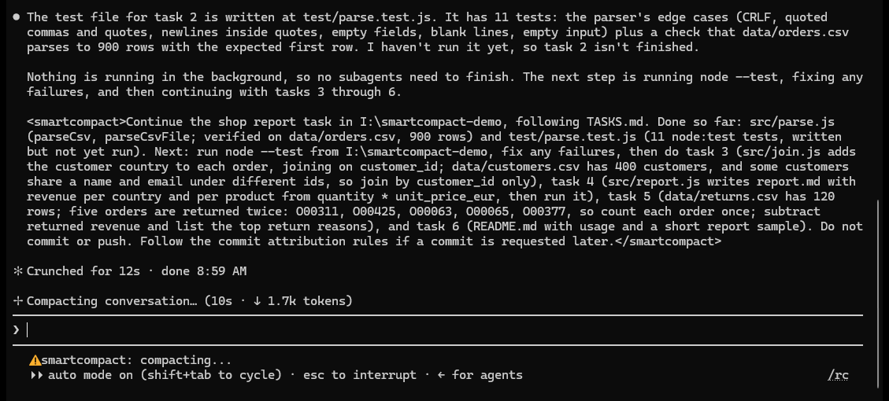

# smartcompact

A Claude Code mod that compacts the conversation at a good moment and then tells Claude to keep working.



Claude Code compacts on its own when the context is almost full, often in the middle of a task. The summary can then
drop the details that task still needs. A long context also makes each turn slower and uses more of your plan.
smartcompact compacts earlier, between two pieces of work, in two ways:

- **The session asks.** The plugin gives Claude a short rule. When Claude finishes a piece of work and the next piece
  can start right away, it ends its answer with `<smartcompact>the prompt for the next piece</smartcompact>` and
  stops. The plugin compacts and sends that prompt. Once the conversation has grown enough, the plugin reminds Claude
  of this rule during the turn, so a busy session also picks a moment.
- **A judge decides.** After a turn that ends without the tag, a small judge model reads the end of the session and
  says whether this is a good moment. A good moment is a finished piece of work, for example when Claude offers to
  push, open a PR or start the next task. A bad moment is mid-fix, mid-debug, failing tests or steps of the current
  task left. The judge is Haiku on your own Claude login, so its small calls count toward your plan.

It never compacts while subagents run, while you have text in the prompt box or while a dialog is open. It also waits
until the conversation has grown by 60k tokens since the session started or since the last compaction. This is the
token floor. After its own compaction it sends a continue prompt, so Claude goes on with the work.

The plugin lives in [`plugin/smartcompact`](plugin/smartcompact). Its [README](plugin/smartcompact/README.md) covers
the status line, the options, the continue prompt and the log.

## Requirements

- Claude Code 2.1.289 or newer.
- The plugin uses the function hooks API. That API is in early access and can change between releases.

## Install

This repo is a plugin marketplace. Add it and install the plugin, so every session loads it:

```
claude plugin marketplace add ambervdberg/smartcompact
claude plugin install smartcompact@smartcompact
```

Keep Claude Code's own auto-compact on. smartcompact usually compacts before the context gets full, and auto-compact
stays as the safety net for a session that never reaches a good moment.

## Settings

The token floor (`minTokens`, 60k by default), the judge model and the continue prompt can all be changed. The
[plugin README](plugin/smartcompact/README.md#options) shows how.

## License

[MIT](LICENSE)
