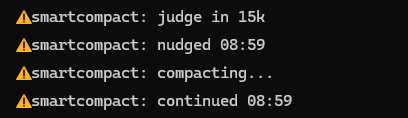

# smartcompact

A Claude Code mod that compacts the conversation at a good moment and then tells Claude to keep working. The
[repo README](../../README.md) covers install and requirements.

```
claude plugin marketplace add ambervdberg/smartcompact
claude plugin install smartcompact@smartcompact
```

## What it does

During a turn above the [token floor](#token-floor), the plugin adds a hidden note after a tool result of the main
conversation. The note asks Claude to compact at the next good moment: start no new subagents, let the running ones
finish, then end the answer with the compact tag. See [The nudge](#the-nudge).

After each turn of the main conversation:

1. When the answer ends with the compact tag, the session asked for a compaction itself. The judge is not asked.
   See [When the session asks](#when-the-session-asks).
2. It checks the context size. Below the token floor it does nothing.
3. It waits while subagents or teammates still run.
4. It asks a small judge model whether this is a good moment to compact. A good moment is a finished piece of work,
   for example when Claude offers to push or to start the next task. The turn never waits for the judge.
5. On a yes it checks that no new turn and no new subagent started meanwhile. Then it waits until the prompt box is
   empty and no dialog is open, and runs a compaction with the instructions
   `Keep the current goal, the next step and open decisions.`
6. After its own compaction it sends the [continue prompt](#continue-prompt), so Claude goes on with the work. It
   never sends one after a compaction it did not start, such as `/compact` typed by hand or Claude Code's own
   auto-compact.

If you start a new turn before the compaction runs, the plugin drops it. The next finished turn is judged again.
A dialog that stays open for two minutes also drops it.

### Token floor

The floor (`minTokens`, 60k by default) counts only the tokens added since a starting point, not the whole context:

- The starting point is the first turn of the session, the first turn after a `/clear`, or the first turn after a
  compaction.
- That first turn itself is never judged.
- The count starts from the context size when that first turn began: the input of its first model request, so the
  context plus the prompt. A first turn with only one request counts from its size at the end.
- So a new session does not count its startup context, and a compaction cannot follow right after another one.
- Claude Code has no token count before the first answer after a new session or a compaction. A turn that ends
  without a count is not judged, sends no nudge, follows no tag and is not taken as the first turn. The log gets a
  `usage-missing` line.
- A resumed or respawned session keeps its saved count. A resumed session without a saved count starts over as a
  new session: its first turn is not judged and sets the starting point.

A line under the prompt box shows what it is doing, for example `smartcompact: judge in 48k`. It sits next to Claude
Code's own notices. A custom `statusLine` script does not show it.



| Status | Meaning |
| --- | --- |
| `judge in 48k` | Below the token floor. The judge is asked once the conversation has grown 48k more tokens. A new session and a `/clear` show the full floor. So does the first turn after them or after a compaction, because that turn sets the starting point. |
| `judge after next turn` | The floor is reached. The judge is asked when the next turn ends. |
| `waiting for subagents` | Subagents still run, so the judge was not asked. |
| `nudged 14:02` | The session was asked to compact at the next good moment. |
| `judging...` | The judge model is asked. |
| `keep going 14:02` | The judge said this is no good moment to compact. |
| `will compact 14:02` | The judge said yes or the session asked. The compaction follows when the session is free. |
| `yes cancelled 14:02` | The judge said yes, but a new turn or subagent started meanwhile. |
| `request ignored 14:02` | The session asked, but subagents still ran, the loop guard held or the turn had no token count yet. The log says why. |
| `waiting for empty prompt` | A compaction waits until you empty the prompt box. |
| `waiting for idle` | A compaction waits for a dialog to close or for the session to be free. |
| `compacting...`, `compacted 14:03` | The compaction runs or has finished. |
| `compact skipped 14:03` | Claude Code skipped the compaction, for example because a hook blocked it. |
| `continued 14:03` | The continue prompt was sent. |
| `dropped 14:03` | A new turn started, the session stayed busy, you cancelled the compaction or this mode cannot compact (`claude -p`), so the compaction was dropped. |
| `error 14:02` | The judge or a session's request failed. The log says why. A judge reply that is no verdict counts as no and keeps the countdown. The log has a `judge-unreadable` line. |

## When the session asks

The plugin adds a short rule to the context of each conversation, as a block named `smartcompact`. Claude Code
renders it with the first message and again after each compaction or `/clear`. It tells Claude to end its answer
with `<smartcompact>the prompt for the next piece</smartcompact>` when a piece of work is done, the next piece of
the same task can start right away and no longer needs the details so far, and then to stop. It leaves the tag out
when it waits for other sessions or agents, or when all work is done. It also leaves it out when it waits for the
user, unless smartcompact asked it to compact. It never writes an empty tag. Subagents get the block too, so it ends
with `Only the main session does this, never a subagent.`

Only a tag at the very end of a main answer counts. Whitespace may follow it. A tag earlier in the text and a tag
from a subagent do nothing. An empty or blank tag is ignored too, and the turn goes to the judge. When the main
answer ends with the tag, the judge is not asked and the first match below runs:

1. Subagents still run: the request is ignored and logged. A finishing subagent wakes the session, so it never hangs.
2. Loop guard: the request is ignored and logged as `loop guard` when this turn came right after a continue prompt
   the plugin sent without a compaction. Without it a session that tags again at once loops. The guard holds in two
   cases:
   - The previous continue prompt followed a compaction Claude Code skipped. This holds at any token count.
   - The previous continue prompt was sent below the floor, and this turn is below the floor too.
3. Below the token floor: nothing is compacted and the continue prompt is sent at once. The first turn of a new
   session and the first turn after a compaction always count as below the floor.
4. Else the compaction waits for an empty prompt box and a closed dialog, as after a judge yes. The instructions are
   `Keep the current goal, open decisions and what this next step needs: <text>`. When Claude Code skips the compaction,
   the continue prompt is still sent.

The text in the tag fills `{next}` in the continue prompt.

### The nudge

Above the token floor, a tool result of the main conversation can be followed by a hidden note. The note reads:

> smartcompact: this conversation grew 64k tokens since smartcompact started counting. Plan a compaction at the
> next good moment. Start no new subagents and let the running ones finish. Then end your answer with
> `<smartcompact>the prompt to start the next piece with</smartcompact>`. Do this also when you would wait for the
> user, and put your question in the tag. Leave the tag out when the user must confirm an action that is hard to
> undo, such as a push, a delete or a publish.

After a nudge, a question for you goes into the tag. After the compaction the shipped continue prompt asks Claude to
decide it. Your own continue prompt can ask Claude to write that choice to the [choices file](#choices-file). A yes or
no on an action that is hard to undo stays a normal stop for you to answer.

The number is the tokens added since the floor started counting, in thousands. The first note comes with the first
tool result above the floor. The next one comes each time the conversation grows another half floor, at least 10k.
The count starts over after a compaction, a `/clear` or a new session. There is no note for subagents and none while
the floor waits for its first turn. The status line shows `nudged 14:02` and the log has a `nudge-sent` line. A
refused note is logged as `nudge-error`.

## Options

Set them with `/plugin configure smartcompact@smartcompact` in a session, or in `settings.json`:

```json
{ "pluginConfigs": { "smartcompact@smartcompact": { "options": { "minTokens": 80000 } } } }
```

A plugin loaded with `--plugin-dir` uses the key `smartcompact` instead of `smartcompact@smartcompact`.

| Option | Default | What it does |
| --- | --- | --- |
| `minTokens` | `60000` | The [token floor](#token-floor): tokens added before the judge is asked or a session's request compacts. |
| `claudeModel` | `haiku` | Model alias or id for the judge. It runs on your own Claude login and needs no setup. |

## Continue prompt

The plugin sends a continue prompt after its own compaction and after a tag below the token floor. It reads the text
from a file each time it sends it, so an edit works at once:

- `~/.claude/smartcompact/continue-prompt.md` when it exists. This is your own copy. An empty file turns the continue
  prompt off.
- Else `continue-prompt.md` in the plugin folder, the shipped default.

Run `/smartcompact-prompt` to copy the default to your own file. It prints the path and says when it just made the
file. A file that exists stays as it is.

When nothing was compacted, a first line `Context was compacted automatically.` is left out. Any other first line
stays.

The plugin fills these placeholders when it sends the prompt, each time they occur.

| Placeholder | Replaced with |
| --- | --- |
| `{next}` | The text in the session's tag. After a judge yes: `Continue where you left off. If the next step is clear, do it.` Keep it in your own file, else the session's prompt for the next piece is lost. |
| `{choicesFile}` | The absolute path of the choices file, in the platform's own spelling. |
| `{choicesHeading}` | One line `## <ISO time> \| <cwd> \| <session id>`, with the time of sending. |

## Choices file

Your own continue prompt can ask Claude to write down the choices it made for you in one central file,
`~/.claude/smartcompact/choices.md`. It sits in the same folder as the log, so `SMARTCOMPACT_LOG` moves it too. For
example:

```
Append your choices to {choicesFile}. Create the file if it is missing and never overwrite earlier text. Start with this line:
{choicesHeading}
Then write one bullet per choice you made for me, with what you chose and why.
```

A filled heading looks like `## 2026-10-04T10:00:00.000Z | C:/work | session-1`. Each continue adds one block that
starts with this line, followed by one bullet per choice. A dashboard can split the file on lines that start with `## `.

## Log

Each decision is written as one JSON line to `~/.claude/smartcompact/log.jsonl` (`SMARTCOMPACT_LOG` picks another
file). It stays on your machine and keeps only its newest 2 MB. The log keeps no text from the conversation and no
text the judge wrote. A line holds the event, the time and details such as token counts, the length of the judge's
reason (`reasonChars`) or an error message. The rows of a compaction carry `source`: `judge` or `request` (the
session's tag). A `compact-started` row shows that the compact call began.

## What it reads, sends and writes

The mod keeps no text from your conversation and sends nothing to the author or to any server of its own. The only
call that leaves the session is the judge, on your own Claude login. It needs no account, key or setup.

**Sends to the judge.** After a turn above the token floor, the judge model gets:

- the last prompt of the person, its first 2000 characters
- the end of the last answer, its last 4000 characters
- a one-line summary of the last 40 tool calls since that prompt, 150 characters each

The judge runs through the engine's own model call on your Claude login (`claudeModel`, Haiku by default). Nothing
else leaves the session.

**Submits as a prompt.** Only the [continue prompt](#continue-prompt), after its own compaction or after a tag below
the token floor. It is the text of your own `continue-prompt.md` or the shipped default, with the placeholders filled:
the text of the session's tag, the path of the choices file and a heading line with the time, folder and session id.

**Changes in the session.**

- `prompt.context` adds one block named `smartcompact` with the rule from [When the session asks](#when-the-session-asks).
  It changes no other block.
- `session.append` adds the [nudge](#the-nudge) as a hidden row to the main conversation. A subagent gets none.
- `command.run` handles only its own command, `/smartcompact-prompt`.
- It runs `/compact` with the instructions shown in [What it does](#what-it-does).

**Writes two files, both in its own folder:**

- `~/.claude/smartcompact/log.jsonl`, or the file `SMARTCOMPACT_LOG` names. One line per decision, with the token count
  and for a judge call the length of the judge's reason. It keeps no text from the conversation and no text the judge
  wrote. See [Log](#log).
- `~/.claude/smartcompact/continue-prompt.md`, only when you run `/smartcompact-prompt` and the file does not exist. It
  is a copy of the shipped default, for you to edit.

It edits no settings, instructions, hooks, build or start-up file. It reads only its own files, the session's messages
and token count, the prompt box and the list of running subagents.

## Development

```
claude plugin validate .
claude plugin test .
npx -p typescript tsc -p .
```

Claude Code writes the API types to `.claude-plugin/types/` when it loads the plugin from a folder. `tsc` needs them
there. The tests cannot read the disk, so `tests/fake-engine.ts` holds a copy of `continue-prompt.md`. Keep the two
the same.
